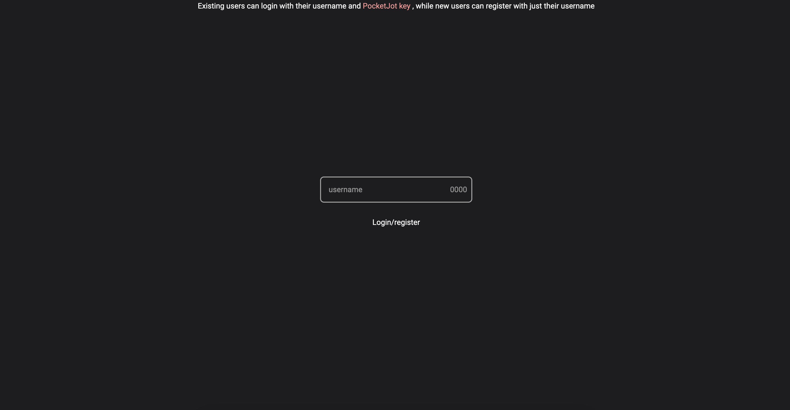
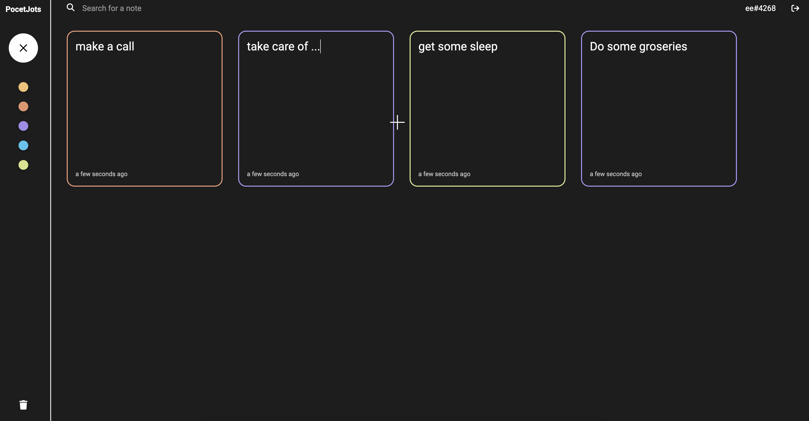
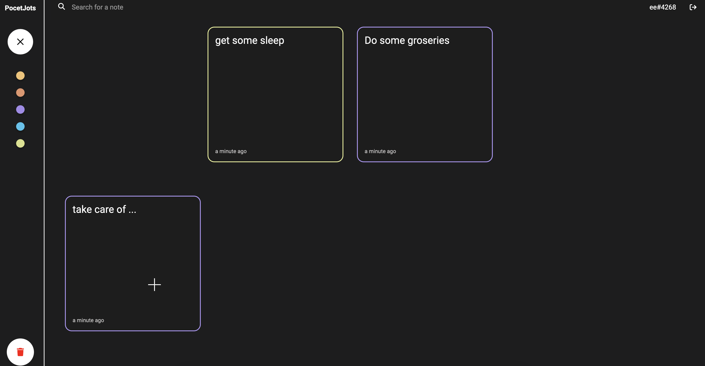

# Pocket Jots

Pocket Jots is a minimalist note-taking web application designed for quick and easy jotting down of ideas. With a React frontend and Django backend, it provides a smooth and responsive user experience, complete with cool animations and a straightforward authentication system.

## Features

- **Simple Authentication**: Easy-to-use signup and login process.
- **Note Management**: Create, read, update, and delete notes.
- **Cool Animations**: Enjoy a lively interface with engaging animations.
- **Responsive Design**: Use Pocket Jots on any device, with layouts that adapt to screen size.

## Getting Started

### Prerequisites

- Node.js
- Python 3 and pip
- Django

### Installation

Clone the repository and set up the frontend and backend separately.

#### Backend Setup

```bash
git clone https://github.com/Hisokaqq/PocketJots
cd PocketJots/backend
pip install django djangorestframework django-cors-headers djangorestframework-simplejwt pillow
python manage.py migrate
python manage.py runserver

cd PocketJots/frontend
npm install
npm start
```




